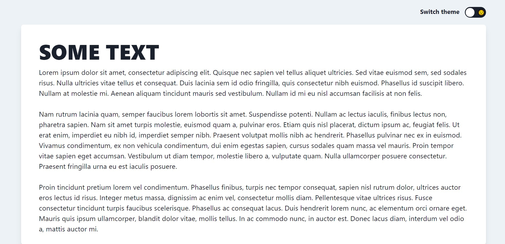

# Tailwind & React Theme Switcher

This is a prove of concept on how to switch themes using Tailwind and React (even though this would work using any Javascript framework or even vanilla Javascript).

## How?

To achieve this I used CSS variables. As stated [here](), Tailwind allows to set colors based on a CSS variable. So I set the background primary, secondary and text color to a CSS variable and then changed its color from a React Component.

---
Also, I tried to emulate [Create React App](https://create-react-app.dev/docs/getting-started/) theme switcher toggle.

Create React App's version

My version

---

Check it out [here](https://ivb98.github.io/react-tailwind-theme-toggler/)!
